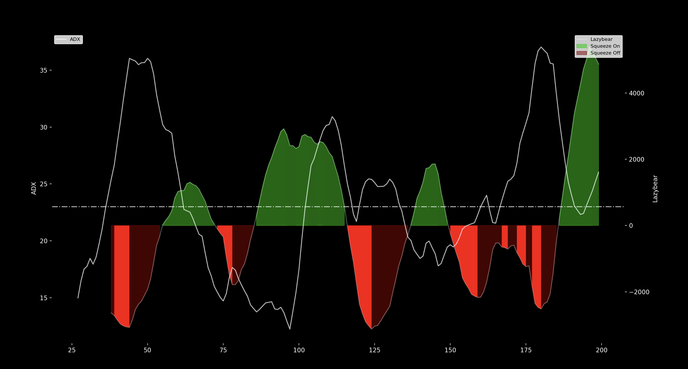

# Estrategias de Trading con Python ✅

- [Youtube Playlist](https://www.youtube.com/playlist?list=PLYlZyIXUXErFnQN9ZJ_UAmV84DiXHFd1Z)

### Contenido

| Clase                                         | Status |
| --------------------------------------------- | ------ |
| Teoría 📚                                     | ✅     |
| Indicadores de análisis técnico               | ✅     |
| Binance Spot API 🪙                           | ✅     |
| Creando BOT para Binance Spot 🪙              | ✅     |
| Candlesticks para nuestro Bot Binance Spot 🪙 | ✅     |
| Refactorizando nuestro robot 🪙               | ✅     |
| Agregando indicadores a nuestro Bot 🪙        | ✅     |
| Estrategia de TradingLatino 🪙                | ✅     |
| Mejorando y graficando el Lazybear 🪙         | ✅     |
| Graficando Lazybear como en TradingView 🪙    | ✅     |

---

### 1. Teoría 📚

- Trading Sistematico.
- Modelado Quantitativo.
- Backtesting.

- Estrategia
  - Proposito
  - Manejo de Datos
  - Universo de inversio
  - Asignacion y nivel de Riesgo
  - Reglas Entrada y Salida
  - Reequilibrio
  - Cuantificar Riesgo
    - Relacion de Sharpe
  - Mark to Market

Riesgo como moneda para la restabilidad.

Grafica Final:

---

# Python For Finance By NeuralNine

- [Youtube Playlist](https://www.youtube.com/playlist?list=PL7yh-TELLS1HJzPsb6Xjdse2zbyQ-ocDH)

### Teoría

| Clase                                                    | Status |
| -------------------------------------------------------- | ------ |
| Visualizing Stock Data With Candlestick Charts in Python |        |

---

# Python and Statistics for Financial Analysis

- [Coursera](https://www.coursera.org/learn/python-statistics-financial-analysis)
- [Notas](./PythonStatisticsforFinancial.md)

---

# Python Quant/Algorithmic Trading. Introducing the Course (1/25) - 8Hours, 25 Parts

- [Course](https://www.youtube.com/playlist?list=PLs6THB5KHWo2k0OdWXbu_pB_0n2KzpGC1)
- [Notas](./PythonQuantAlgorithmicTrading.md)

---

# Curso Gratis De Trading Algorítmico De Criptomonedas ✅

- [Youtube Playlist](https://www.youtube.com/watch?v=SiXWX0WsNS8)

### Componentes Basicos

- Condicion de entrada
- Condicion de Salida
- Gention del Dinero

### Tipos de condiciones

- Patrones de Velas
- Patrones de Volumen
- Patrones de Indicadores Tecnicos
- Patrones Temporales
- Combinacion de Todos

### Algoritmico vs Manual

|                   | Algoritmico | Manual |
| ----------------- | ----------- | ------ |
| - Autimatizacion  | ✅          | ❌     |
| - Precision       | ✅          | ❌     |
| - Deversificacion | ✅          | ❌     |
| - Riesgos         | ✅          | ❌     |
| - Psicologia      | ✅          | ❌     |

### Plataformas de Creacion

- TradingView
- Multicharts
- Metatrader
- Python
- StartegyQuant
- FxDreema

### Server

- VPS
- PC
- Exchages

### Como desarrrollar una estrategia desde Cero

- Datos
- Busqueda de Patrones
- Crear Algoritmos
- Analisis de Resultados
- Puesta en Marcha

### Como desarrrollar una estrategia desde Cero

- Esperanza matematica
- Tipos de estartegias

| Tendencial                     | Ante - Tendencial              |
| ------------------------------ | ------------------------------ |
| Buscar Largas tendencias       | Buscan reversiones a la media  |
| Dejan correr ganancias         | Cortan rapido las ganacias     |
| Menor Ratio de aciertos (30%)  | Mayor ratio de aciertos (70%)  |
| Mayor Ratio Riesgo / Beneficio | Menor ratio riesgo / beneficio |

- Diversificacion y Decorrelacion
- Costos Operativos

  - Comisiones &rarr; Broker
  - Spread &rarr; Compradores y vendedores
  - Slippages &rarr; Delay y Liquidez

- Riesgos

  - Exchange
  - Apalancamiento
  - Gestion inadecuada de la estrategia

- Siguientes Pasos (BUSCAR)

  - Optimizacion Automatizada
  - Robustez de las Estrategias
  - Test de montecarlos
  - Test Permutacion de Parametros
  - Test Milti-mercado
  - Test Multi-Timeframe
  - Automatizacion de la Operativa
  - Gestion de Portafolio
